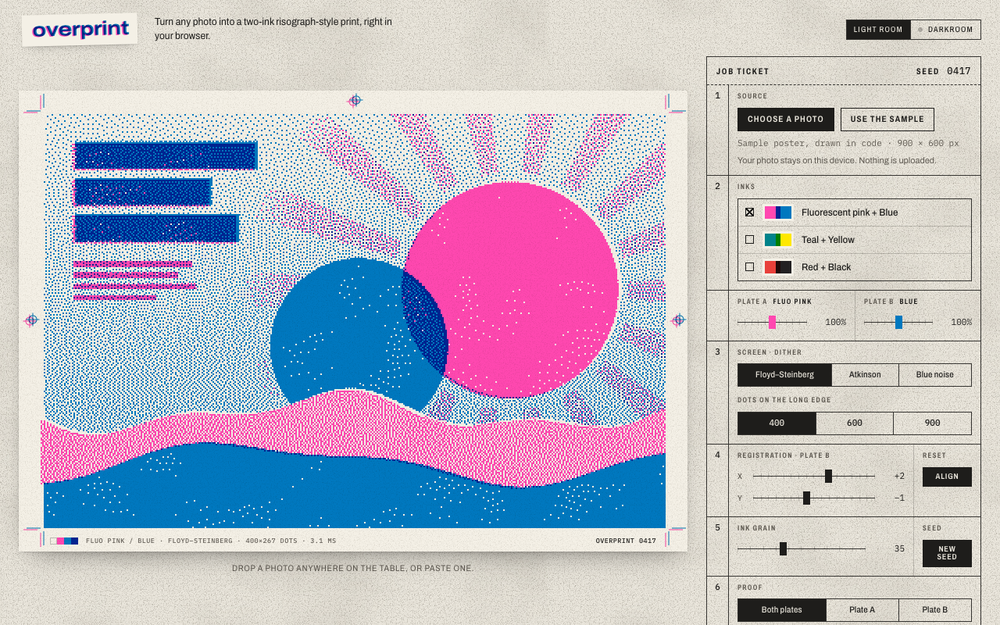

# overprint

Turn any photo into a two-ink risograph-style print, right in your browser.



overprint splits a photo into two spot-ink plates, dithers each plate into dots, knocks the second plate slightly out of register, adds ink grain, and overprints the two inks on paper, multiplying them the way real transparent ink does. All the image processing is Rust compiled to WebAssembly. Your photo never leaves the device.

## The 30-second experience

1. Open the page. A sample poster is already on the press: big flat shapes, a few tints and a headline, so the grain, the overprint and the mis-registration show at a glance. It is drawn in code as two plates (no photograph, no copyright) and repainted in whichever inks you pick.
2. Drop, paste or choose your own photo.
3. Pick an ink pair: **fluorescent pink + blue**, **teal + yellow**, or **red + black**.
4. Pick a screen: **Floyd–Steinberg**, **Atkinson** or **blue-noise** dithering, at 400 (the default, coarse like a real stencil print), 600 or 900 dots on the long edge. Where there is room, the preview draws every dot as a whole number of screen pixels, so the grain stays crisp.
5. Slide plate B out of register (the registration marks on the sheet drift apart too), add ink grain, change each plate's density, or proof one plate on its own.
6. **Export PNG**: each dot becomes a crisp square of whole pixels, so the long edge is at least 2400 px: exactly 2400 px at 400 or 600 dots, and 2700 px at 900. The page shows the exact size next to the button.
7. Tick **Race plain JavaScript** to time the same job in both engines on your own machine. You get the median of 7 alternating runs, plus a byte-for-byte check that both outputs are identical.

## How it works

| Step | What happens (Rust, `src/`) |
| --- | --- |
| Separate (`separate.rs`) | Each pixel and each ink becomes an "absorption" vector (`255 − value` per channel). A 2×2 least-squares solve finds the ink A / ink B coverage that best explains the pixel. If the answer falls outside what the inks can print, one coverage is clamped and the other re-solved. |
| Grain (`grain.rs`) | Plate density is scaled first, then two layers of seeded noise are added: fine per-dot hash noise and coarse 16-dot value noise. The change is proportional to the coverage, so bare paper stays bare. |
| Dither (`dither.rs`) | Floyd–Steinberg (serpentine scan, 7/3/5/1 split that conserves error), Atkinson (6 taps of ⅛, drops ¼ by design), or an ordered threshold against a **64×64 blue-noise map generated in code** with Ulichney's void-and-cluster method. The job seed offsets each plate's blue-noise tile. |
| Register and overprint (`compose.rs`) | Plate B is shifted by whole dots (clamped to ±16). Anything that slides in from outside the sheet is bare paper. Where both inks print, the colour is `paper × (A/paper) × (B/paper)`. |

**Deterministic by construction.** Every step uses integer maths only (wrapping `u32` hashes, arithmetic shifts, truncating `i64` division) and every random choice is seeded. The same resized pixels and settings give the same bytes everywhere. The tests pin golden fingerprints that native Rust, the wasm32 build and the JavaScript reference all have to hit.

`web/reference.js` is a line-for-line plain-JavaScript port. It exists for the speed race, and as a clearly labelled fallback if WebAssembly fails to load. `web/app.js` handles the page: file loading, canvas drawing, layout and export. `web/intake.js` checks a file before the browser decodes it (see *Large or unusual images* below).

## Why Rust → WebAssembly

- **The language does the real work.** Per-pixel least squares, serpentine error diffusion, void-and-cluster generation, seeded grain and compositing all live in Rust. The JavaScript glue only moves pixels in and out.
- **Bit-exact results.** Rust's explicit integer types make it straightforward to specify the maths exactly, then hold a JS port to the same answer. WebAssembly runs that specification identically on every device.
- **Predictable speed, small payload.** No garbage-collection pauses during a render, and the whole engine is a ~36 KiB `.wasm` file.
- **Honest about the margin.** Modern JavaScript engines are very good at typed-array loops, so the gap is real but not dramatic, and it varies a lot by device and browser. That is why the page measures it live instead of quoting a number.

## Build

Requirements:

- Rust 1.88 or newer (declared as `rust-version` in `Cargo.toml`) with the `wasm32-unknown-unknown` target
- `wasm-bindgen-cli` **0.2.129** (it must match the version pinned in `Cargo.toml`)
- Node.js 20 or newer
- Optional: `wasm-opt` (binaryen) for an extra size pass. The build skips it if it is not installed.

```sh
rustup target add wasm32-unknown-unknown
cargo install wasm-bindgen-cli --version 0.2.129

npm run build     # compiles Rust -> wasm, generates bindings, copies web/ -> dist/
npm run serve     # preview dist/ at http://127.0.0.1:8080 (serves the production _headers too)
```

There are no npm dependencies. `dist/` is plain static files.

## Test

```sh
npm test          # cargo test, then npm run build, then node --test tests/*.test.mjs
```

- **Rust unit and integration tests** (`cargo test`, 35 tests) cover:
  - separation: pure inks map to their own plate, white needs no ink, black and tints, degenerate ink pairs
  - known-answer cases for every dither kernel (1×4, 2×2 and 4×4, cross-checked against an independent scalar model)
  - the blue-noise map: a permutation of 0–4095, exact 50% dot count, minimum spacing
  - grain range and seeding
  - mis-registration shifts, clamping and bounds
  - parameter validation
  - seeded determinism and golden fingerprints
- **JS vs Rust equality** (`tests/equality.test.mjs`) runs in Node against the built WASM:
  - more than 1,000 byte-for-byte comparisons on small synthetic images
  - every preset × dither × proof view
  - sweeps of grain, density, registration and seed
  - out-of-range parameters
  - the golden fingerprints
- **Smoke** (`tests/smoke.test.mjs`) checks that `dist/index.html` loads `app.js`, which imports the wasm-bindgen module, that every local asset exists, that the `.wasm` validates and renders, and that the CSP allows WebAssembly.
- **Browser** (`tests/browser.test.mjs`) runs real headless Chrome through the DevTools protocol against `dist/`, served with the production headers. It checks:
  - the page renders with the WebAssembly engine, starting on the sample poster at 400 dots, 2 screen pixels per dot at 1280 × 800
  - the in-page race finds identical output
  - a text file, a corrupt PNG, an SVG and a 200-megapixel PNG header all produce clear messages, and the print stays
  - there are no console errors or uncaught exceptions
  - there is no horizontal scroll at 400 px, in both themes

  The test skips if Chrome is not found; set `CHROME_PATH` to point at one. **In CI, set `REQUIRE_BROWSER=1`**: then a missing Chrome fails the run instead of skipping (`tests/browser-flag.test.mjs` checks both behaviours).
- **Page logic** runs in Node without a browser:
  - `tests/intake.test.mjs`: format sniffing, the SVG message, the 100-megapixel cap and the working-copy size
  - `tests/sizes.test.mjs`: the export sizes quoted above, and whole-pixel preview scaling
  - `tests/contrast.test.mjs`: text colours reach WCAG AA (4.5:1) in both rooms, read straight from `styles.css`

## Cloudflare (free tier, static only)

`dist/` is about ten static files, including one ~36 KiB `.wasm`. No Worker, KV, D1 or server code, and no API calls of any kind. That sits well inside Cloudflare Pages' free static-asset limits (unlimited requests, 20,000 files per site, 25 MiB per file).

It is **deploy-ready, not deployed**. To deploy, build locally, then upload `dist/` directly:

```sh
npm run build
npx wrangler pages deploy dist --project-name overprint
```

There is deliberately no `npm run deploy` script and no `account_id` in `wrangler.toml`: the plain command above uses whatever Cloudflare login is active, which is fine for your own copy. The owner deploys this project through a separate, guarded script that checks which account it is about to use.

Direct upload is the intended path, because Pages' own build image is not assumed to have Rust and wasm-bindgen installed. `dist/_headers` sets:

- a strict Content-Security-Policy (`script-src 'self' 'wasm-unsafe-eval'`, no inline scripts or styles)
- `nosniff`
- `no-referrer`
- a locked-down Permissions-Policy

No long cache lifetime is set: `app.js`, `pkg/overprint.js` and `pkg/overprint_bg.wasm` keep fixed names, so a `max-age` could pair a fresh `app.js` with a stale engine after a redeploy. Pages' default (revalidate every time) avoids that.

## Privacy

- No uploads, no analytics, no cookies.
- The only third-party request is Google Fonts (Archivo and IBM Plex Mono). If it fails, the page falls back to system fonts.
- `localStorage` holds a single value: your Light room / Darkroom choice.

## Honest limitations

- **Ink colours are on-screen sRGB approximations** chosen by eye, not measured ink data. Real spot inks, paper and presses will look different, and no screen can show fluorescent ink.
- **The separation is a linear least-squares fit** in absorption space: a good-looking approximation, not a colour-managed separation. Colours two inks cannot make are clamped to the nearest printable mix. A saturated green, for example, cannot come out of pink + blue.
- **"Same result on every machine" starts after resizing.** Photos are first resized with the browser's canvas (once to a 900-px working copy, then to 400/600/900 dots), and that resampling can differ slightly between browsers. From those pixels onward, the engine is bit-exact.
- **Mis-registration is a whole-dot shift** of plate B only. There is no rotation, skew or paper stretch.
- **Timings come from `performance.now()`**, which browsers deliberately coarsen (often to about 0.1 ms). Each race uses one warm-up run and 7 alternating timed runs per engine. The single-render time shown under Output is one run.
- **Rendering runs on the main thread.** It is quick at these sizes (the page shows the measured time for each print), but larger outputs would want a Web Worker.
- **Whole-pixel preview needs room.** On a phone with 2 screen pixels per CSS pixel, 400 dots cannot fit at a whole number of pixels per dot without shrinking the print to about half the screen, so the preview fits the space instead and the dots are drawn 1–2 pixels wide.
- **Large or unusual images:**
  - Before decoding, the page reads the file's first bytes to find its real format and, for PNG, JPEG, GIF, WebP and BMP, its size in pixels. Files over 80 MB or 100 megapixels are refused with a message that gives the numbers.
  - If a JPEG's size is buried beyond the first 256 KB, it is decoded first and then checked against the same cap.
  - Each photo is decoded once, drawn into a working copy no bigger than 900 px on the long edge (the largest dot count), and the full-size decode is released straight away.
  - SVG drawings are not supported; the page says so and asks for a photo (JPEG, PNG or WebP).
  - Some browsers cannot open HEIC; if the file really is HEIC, the page says so and suggests saving it as JPEG.

## Next

- SVG export (each plate as vector dots or paths)
- More ink presets, a custom ink picker and paper colours
- Halftone screens (angled AM dots) alongside the dithers
- Per-plate rotation and skew in the registration model
- Render in a Web Worker; run `wasm-opt` in the build
- Export each plate separately as a greyscale file, ready for a real press

## Credits

Built by Ramen Protocol with AI assistance (Claude). overprint is independent and not affiliated with any printer or ink maker. "Risograph-style" only describes the look.

## License

[MIT](LICENSE)
